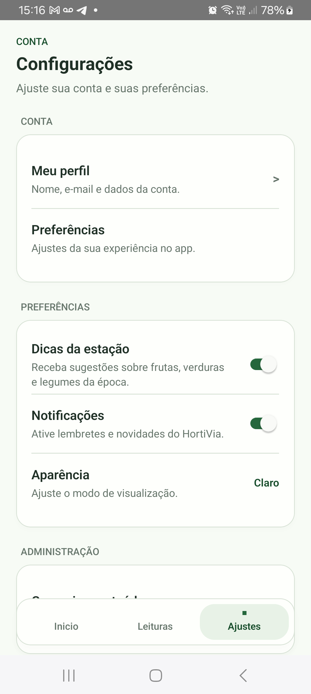
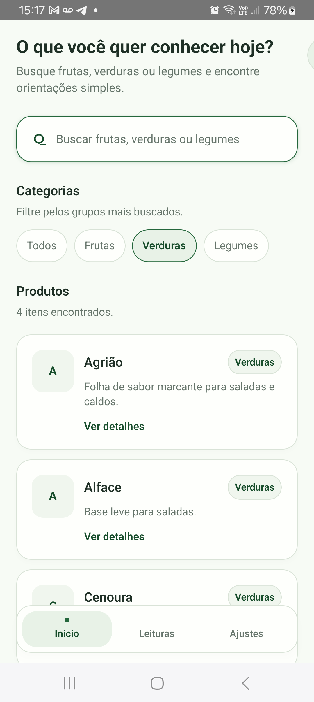
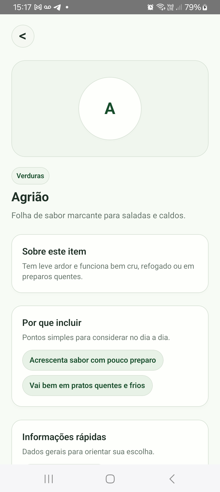
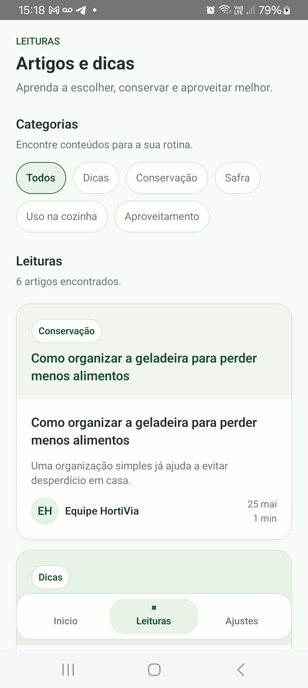

# HortiVia

Guia mobile para conhecer, escolher e aproveitar melhor frutas, verduras e legumes.

## Sobre o projeto

HortiVia é um guia mobile para consulta prática sobre frutas, verduras e legumes. O aplicativo reúne informações úteis para ajudar na escolha, na conservação e no melhor aproveitamento desses alimentos no dia a dia.

A proposta é facilitar decisões simples, mas importantes, como identificar melhor um produto, entender como armazená-lo em casa e encontrar orientações rápidas de uso sem depender de buscas dispersas.

## Problema

Muitas pessoas compram hortifruti sem saber avaliar qualidade, ponto de consumo ou formas adequadas de conservação. Isso pode levar a escolhas ruins, perda de alimentos e mais desperdício dentro de casa.

## O que o usuário encontra no app

- Guia de frutas, verduras e legumes
- Busca por nome do produto
- Filtros por categoria
- Informações práticas sobre cada alimento
- Orientações para escolher melhor
- Dicas de conservação
- Sugestões de aproveitamento
- Conteúdos educativos sobre hortifruti
- Informações voltadas à redução de desperdício
- Experiência mobile simples para consulta rápida

## Demonstração visual

Alguns registros da experiência mobile do HortiVia serão adicionados nesta seção para mostrar a navegação principal, a consulta de produtos e os conteúdos educativos.

## Status

Versão funcional em fase de testes internos.

## Próximas evoluções

- Favoritos
- Histórico de produtos consultados
- Conteúdos relacionados por categoria
- Recomendações com base nas preferências do usuário
- Recursos sociais em conteúdos educativos

## Tecnologias

Projeto desenvolvido com React Native, TypeScript, NestJS, Prisma e PostgreSQL.

## Documentação complementar

- Vitrine visual e captura de prints: [docs/visual-showcase.md](docs/visual-showcase.md)
- Galeria para portfólio e redes: [docs/portfolio-gallery.md](docs/portfolio-gallery.md)
- Orientações de captura: [docs/screenshot-capture-checklist.md](docs/screenshot-capture-checklist.md)
- Execução local e notas técnicas: [docs/development.md](docs/development.md)
- Arquitetura e organização interna: [docs/architecture.md](docs/architecture.md)
